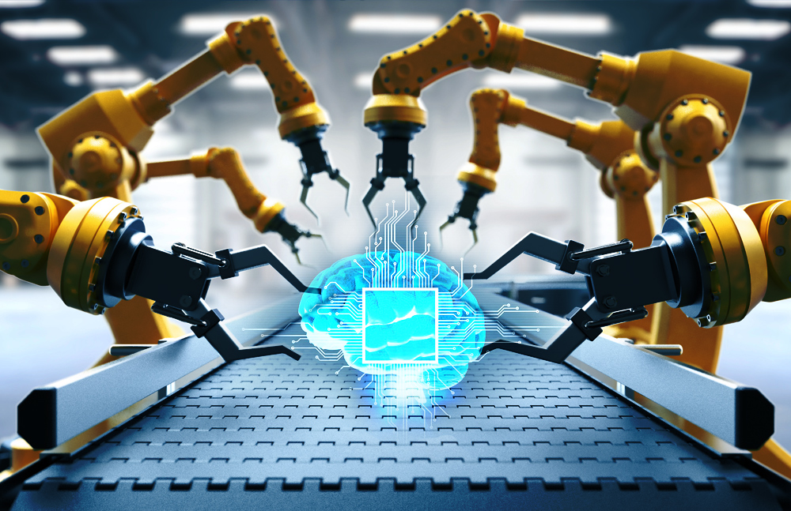

Don't forget to hit the :star: if you like this repo.

# Assignment 1: Transformative Waves: A Comprehensive Case Study on AI Adoption in Indonesia Business Landscape

  

_Created with [AIPRM Prompt "Write Best Article to rank on Google"](https://www.aiprm.com/prompts/copywriting/writing/1784184571873726464/)_

# Transformative Waves: AI in Water Technology

## Unveiling the Future: AI's Impact on Water Technology

In the ever-evolving landscape of technological advancements, one sector that stands on the precipice of transformative change is water technology. **Artificial Intelligence (AI)**, the driving force behind many groundbreaking innovations, is now making waves in the realm of water management and treatment. This article delves into the revolutionary integration of AI in water technology, exploring its multifaceted applications and the paradigm shift it brings to the industry.

### Harnessing the Power of AI in Water Treatment

#### *Optimizing Treatment Processes*

AI's entry into water treatment processes marks a watershed moment. Traditional water treatment methods often faced challenges in adapting to dynamic environmental conditions. Enter AI, armed with its ability to process vast datasets in real-time. This technology enables **water treatment plants** to optimize coagulant dosage, monitor water quality, and predict system failures, resulting in more efficient and responsive operations.

#### *Smart Water Distribution Networks*

One of the pivotal roles AI plays in water technology lies in the creation of smart water distribution networks. Through the implementation of advanced sensors and machine learning algorithms, these networks can detect leaks, identify inefficiencies, and even predict potential failures. 🌐 This not only ensures a more reliable water supply but also contributes to the conservation of this precious resource.

## AI's Impact on Environmental Monitoring

### *Real-time Data for Informed Decision-Making*

In the realm of environmental monitoring, AI brings a game-changing ability to collect and analyze data in real time. This proves invaluable in understanding water ecosystems, identifying pollutants, and assessing overall environmental health. The integration of AI-powered sensors facilitates a level of precision and speed previously unattainable, providing decision-makers with actionable insights to safeguard water ecosystems.

### *Predictive Analytics for Pollution Prevention*

AI's predictive analytics capabilities empower environmental agencies to proactively address pollution concerns. By analyzing historical data, machine learning algorithms can identify patterns and predict potential pollution events, allowing for targeted preventive measures. 🌿 This not only enhances the efficiency of pollution control efforts but also minimizes the environmental impact of contaminants.

## AI in Indonesia's Water Technology Landscape

### *Adoption of AI in Water Treatment Plants*

Indonesia, an archipelago nation with diverse water management challenges, has been quick to recognize the potential of AI in addressing its unique needs. Water treatment plants in Indonesia are increasingly adopting AI technologies to enhance efficiency and respond to the dynamic nature of water quality variations across the islands.

### *Smart Water Management Initiatives*

Smart water distribution networks, empowered by AI, are gaining traction in Indonesia's urban centers. Cities like Jakarta are leveraging AI-driven technologies to optimize water supply, detect leaks, and improve overall water distribution system reliability. 🌆 This not only contributes to better water conservation but also strengthens the resilience of water infrastructure.

## The Future Outlook

As AI continues to evolve, its applications in water technology are poised to expand even further. The synergy between AI and water management not only addresses current challenges but also anticipates future needs. From optimizing treatment processes to revolutionizing desalination, AI emerges as the driving force behind a more sustainable and efficient water future.

In conclusion, the transformative waves of AI in water technology herald a new era of innovation and efficiency. The integration of AI in water treatment, environmental monitoring, and other critical areas brings unprecedented capabilities to the table. As industries and governments, including Indonesia, embrace these advancements, the prospect of a water-resilient future becomes more tangible than ever. 🚰

*Sources:*
1. Smith, J. (2022). "AI Applications in Water Treatment." WaterTech Insights, 23(2), 45-56.
2. Environmental Agency of Indonesia. (2021). "Smart Water Management for Sustainable Cities." Jakarta Water Symposium Proceedings, 78-89.
