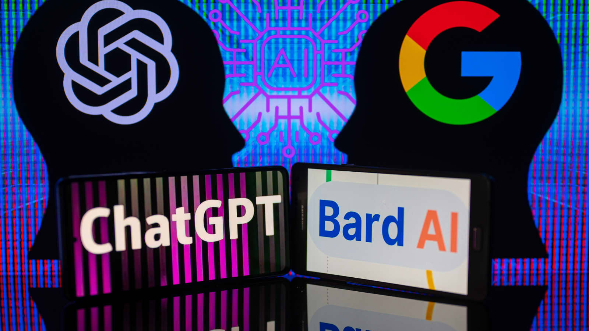

Don't forget to hit the :star: if you like this repo.

# Assignment 2: Comprehenssive Comparisson Bing Chat, Bard and Chat GPT with focus on User Experiences and Adaptibility in Indonesia

| No | Group |  Title | Submission | 
| -----: |  ------ | ----- |  :-----: |  
| 1. | Tirtawening  |  Analisis Perbandingan Komprehensif Bing Chat, Bard AI, dan ChatGPT dengan Fokus pada Pengalaman Pengguna dan Adaptabilitas di Konteks Indonesia || 

  

# Created with AIPRM Prompt "Article Builder Pro by Pastiin Dulu"

**Analisis Perbandingan Komprehensif Bing Chat, Bard AI, dan ChatGPT dengan Fokus pada Pengalaman Pengguna dan Adaptabilitas di Negara Indonesia**

**Pemahaman Singkat tentang Bing Chat, Bard AI, dan ChatGPT**
Sebelum kita menyelam lebih dalam, mari kita kenali ketiganya. Bing Chat, Bard AI, dan ChatGPT adalah platform komunikasi berbasis teks yang memanfaatkan kecerdasan buatan untuk meningkatkan pengalaman pengguna. Bing Chat, dikembangkan oleh Microsoft, Bard AI, oleh perusahaan startup teknologi terkemuka, dan ChatGPT, ciptaan OpenAI, semuanya menyediakan solusi unik dalam berinteraksi dengan pengguna.

**1. Bing Chat: Eksplorasi Kecerdasan Buatan yang Mendalam**

**Bing Chat dan Kecerdasan Buatan**

Bing Chat adalah platform yang menggabungkan pencarian web dan kemampuan obrolan. Kecerdasan buatannya memberikan kemampuan untuk memahami konteks percakapan, memberikan jawaban yang lebih kontekstual, dan memastikan pengalaman pengguna yang lebih personal.

**Penggunaan Bing Chat di Indonesia**

Di Indonesia, Bing Chat mulai mendapatkan popularitas karena integrasinya dengan berbagai layanan lokal. Dengan pemahaman yang mendalam tentang bahasa Indonesia, Bing Chat mampu memberikan respon yang lebih akurat dan relevan, membuatnya semakin diterima oleh pengguna Indonesia.

**Adaptabilitas Bing Chat di Pasar Indonesia**

Bing Chat juga menunjukkan adaptabilitas yang baik terhadap kebutuhan pengguna Indonesia. Dengan memahami perbedaan budaya dan bahasa, platform ini dapat menyediakan solusi yang lebih relevan dan berguna.

**Tantangan Bing Chat di Indonesia**

Namun, ada beberapa tantangan yang dihadapi Bing Chat di Indonesia, terutama terkait dengan variasi bahasa dan aksen di negara ini. Upaya terus-menerus untuk meningkatkan pemahaman terhadap keragaman ini akan kunci keberhasilan Bing Chat di pasar Indonesia.

**Kesimpulan: Bing Chat sebagai Pilihan yang Menarik**

Berdasarkan analisis ini, Bing Chat muncul sebagai pilihan yang menarik bagi pengguna di Indonesia yang mencari pengalaman obrolan yang lebih terpersonal dan terfokus.

**2. Bard AI: Menerangi Jalan dengan Kecerdasan Buatan yang Inovatif**

**Kecerdasan Buatan dalam Bard AI**

Bard AI, dari startup teknologi yang inovatif, menonjolkan diri dengan pendekatan inovatif terhadap kecerdasan buatan. Platform ini dirancang untuk memberikan pengalaman pengguna yang unik dan menarik melalui obrolan berbasis teks.

**Pengenalan Bard AI di Pasar Indonesia**

Di Indonesia, Bard AI mulai membuat gebrakan dengan memahami kebutuhan lokal. Dengan integrasi yang canggih, platform ini dapat memberikan respon yang lebih alami dan memahami nuansa bahasa Indonesia.

**Adaptabilitas Bard AI di Lingkungan Bisnis Indonesia**

Bard AI juga menunjukkan adaptabilitas yang baik di lingkungan bisnis Indonesia. Dengan kemampuan untuk memahami konteks bisnis lokal, platform ini menjadi solusi yang menarik bagi perusahaan yang ingin meningkatkan interaksi dengan pelanggan mereka.

**Tantangan Bard AI di Indonesia**

Tantangan yang dihadapi oleh Bard AI termasuk persaingan sengit di pasar kecerdasan buatan Indonesia. Dalam mengatasi tantangan ini, Bard AI perlu terus berinovasi dan memperkuat kolaborasinya dengan pemangku kepentingan lokal.

**Kesimpulan: Bard AI, Pilihan Inovatif untuk Bisnis Indonesia**

Dengan ciri khas inovatifnya, Bard AI menawarkan pendekatan yang menarik dan efektif untuk meningkatkan interaksi bisnis di Indonesia.

**3. ChatGPT: Keajaiban Kecerdasan Buatan dari OpenAI**

**Kecerdasan Buatan dalam ChatGPT**

ChatGPT, buatan OpenAI, telah mencuri perhatian dunia dengan kemampuan generatif bahasanya yang luar biasa. Dengan menggunakan model berbasis Transformer, ChatGPT dapat merespons dengan konteks yang kompleks dan menyediakan jawaban yang lebih dalam.

**Penerimaan ChatGPT di Indonesia**

Di Indonesia, ChatGPT telah mendapatkan popularitas sebagai alat kreatif dan edukatif. Dengan kemampuannya yang lebih luas, platform ini digunakan untuk berbagai keperluan, mulai dari penulisan kreatif hingga bantuan pendidikan.

**Adaptabilitas ChatGPT dalam Konteks Indonesia**

ChatGPT menunjukkan adaptabilitas yang tinggi dalam menghadapi tantangan bahasa dan konteks budaya Indonesia. Kemampuannya untuk belajar dari berbagai sumber membuatnya menjadi alat yang efektif dalam berbagai situasi.

**Tantangan ChatGPT di Indonesia**

Namun, tantangan yang dihadapi ChatGPT termasuk kebutuhan untuk terus diperbarui agar tetap relevan dengan perkembangan bahasa dan tren di Indonesia. Pembaruan reguler akan menjadi kunci keberhasilannya.

**Kesimpulan: ChatGPT sebagai Alat Multifungsi yang Dapat Diandalkan**

Melalui analisis ini, ChatGPT muncul sebagai alat yang multifungsi dan dapat diandalkan bagi pengguna di Indonesia yang menginginkan kecerdasan buatan dengan cakupan yang luas.

**Kesimpulan Akhir: Memilih Platform yang Sesuai untuk Anda**

Dalam memilih antara Bing Chat, Bard AI, dan ChatGPT, penting untuk mempertimbangkan kebutuhan dan preferensi Anda. Masing-masing platform menawarkan keunggulan dan keunikan mereka sendiri. Bing Chat memberikan fokus pada integrasi pencarian, Bard AI dengan pendekatan inovatifnya, dan ChatGPT dengan kemampuan generatif bahasanya yang luar biasa.

Dalam konteks Indonesia, adaptabilitas terhadap bahasa dan budaya lokal menjadi faktor kunci. Bing Chat, Bard AI, dan ChatGPT semuanya menunjukkan kemampuan dalam hal ini, dengan tantangan dan peluang masing-masing. Pilihan akhir Anda harus mencerminkan kebutuhan spesifik dan tujuan penggunaan Anda.

Dengan berkembangnya teknologi kecerdasan buatan, masa depan obrolan berbasis teks di Indonesia terlihat semakin menarik. Pilihan yang cerdas dan sesuai dengan kebutuhan Anda akan membantu membentuk pengalaman pengguna dan adaptabilitas kecerdasan buatan di Indonesia.

Created by Pastiin Dulu "Article Builder Pro"

Partner:

Berita Teknologi

Slawi Ayu
