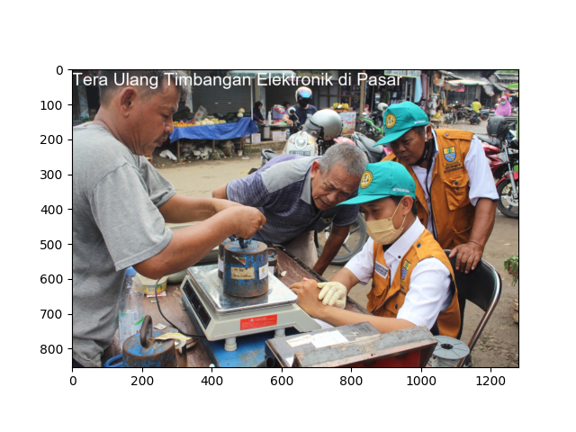

  

<h1 align="center">ABDUL KARIM</h1>

## About Me
I am  Abdul Karim. I work as a government servant in the field of Legal Metrology at the Cooperative, Small and Medium Enterprises (UKM), Trade and Industry Department in Cirebon City, West Java, Indonesia. Currently,  I am enrolled in a master's degree in Regional Innovation with a concentration in Data Science and Business Analysis at Padjadjaran University. My goal is to employ a data-driven approach to make a meaningful contribution and implement concrete improvements in my institution.

## 🌟 Interests
- 📊 Data Analysis and Visualization
- 🌄 Image Analytics 
- 🤖 Artificial intelligence
- 📈 Machine Learning and Predictive Analytics
- 📡 Data Mining and Big Data
- 🐍 Python Programming
- 📉 Statistical Modeling
- 📑 NLP
 
## 🧰 Education
- 🎓 **Master's Degree (Ongoing):** Regional Innovation - Data Science and Business Analysis 
  - **Institution:** Padjadjaran University, Indonesia
 
- 🎓 **Bachelor's Degree:** Physics - Majoring in Geophysics
  - **Institution:** University of Indonesia, Indonesia
  - **Graduation Year:** 2013
    
## 📫 Contact Me

  
  

Together, let's explore the universe of data!
