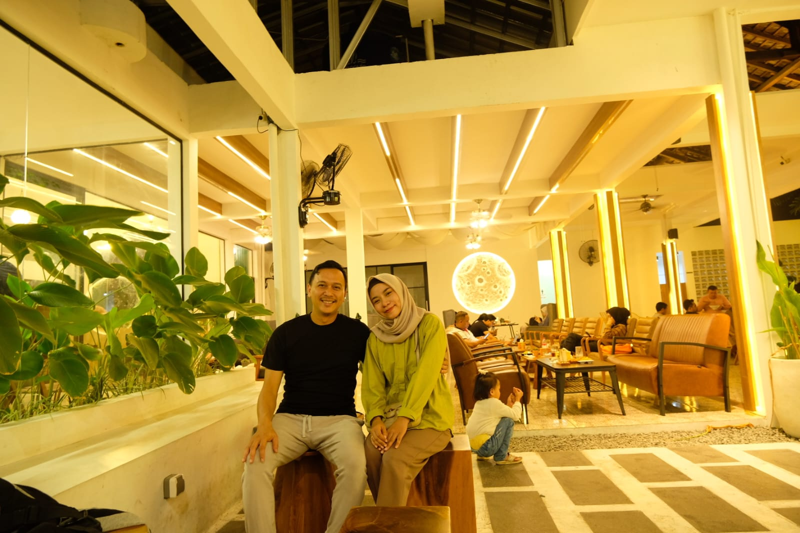

  

<h1 align="center">Hi 👋, I'm Yusuf Kurniawan</h1>
<h3 align="center">I am a civil servant at the Department of Manpower in the city of Cirebont</h3>
 

- 🏢 I’m currently working at Labor Office Cirebon City as **Job placement Officer**

- 🔭 The task of a job placement is to match **job seekers** with available **job vacancies**

- 🌱 I'm postgraduate student at **Padjajaran University in Bandung**

- 💬 Ask me about **Job Vacancies in Cirebon and Surrounding Areas**
  
- 📫 How to reach me **yusuf021454556@@gmail.com**
  
- 👀 Looking for small data science project to improve and update my knowledge.

<h3 align="left">Connect with me:</h3>

<h3 align="left">Languages and Tools:</h3>

     

